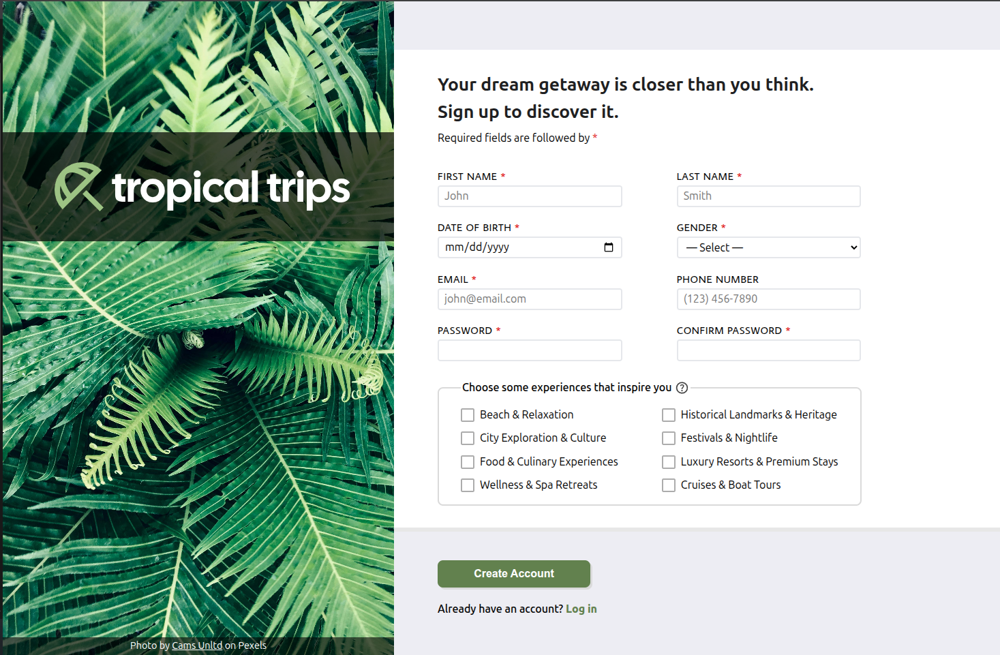
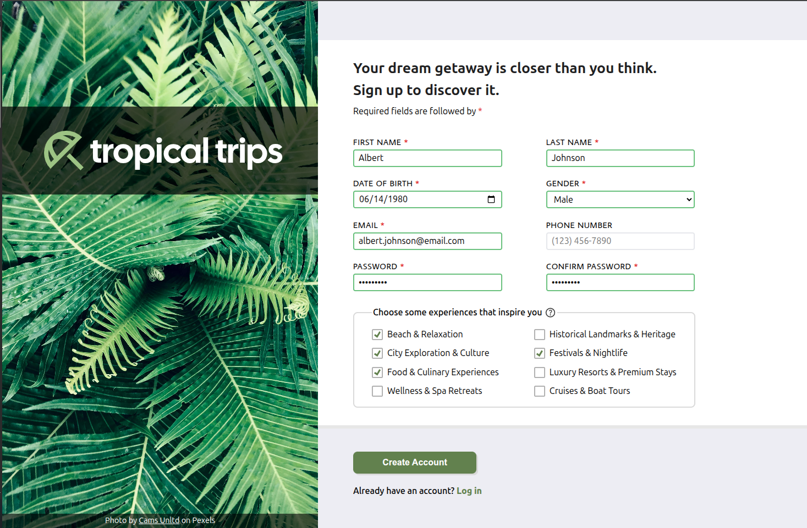
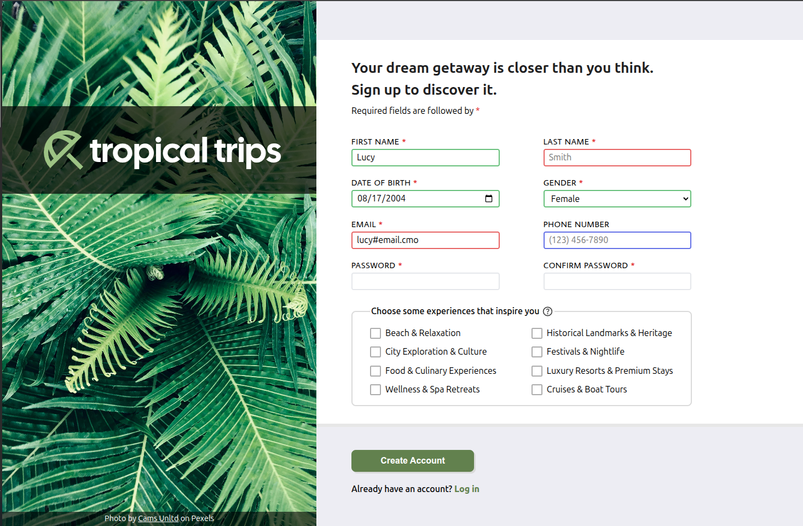
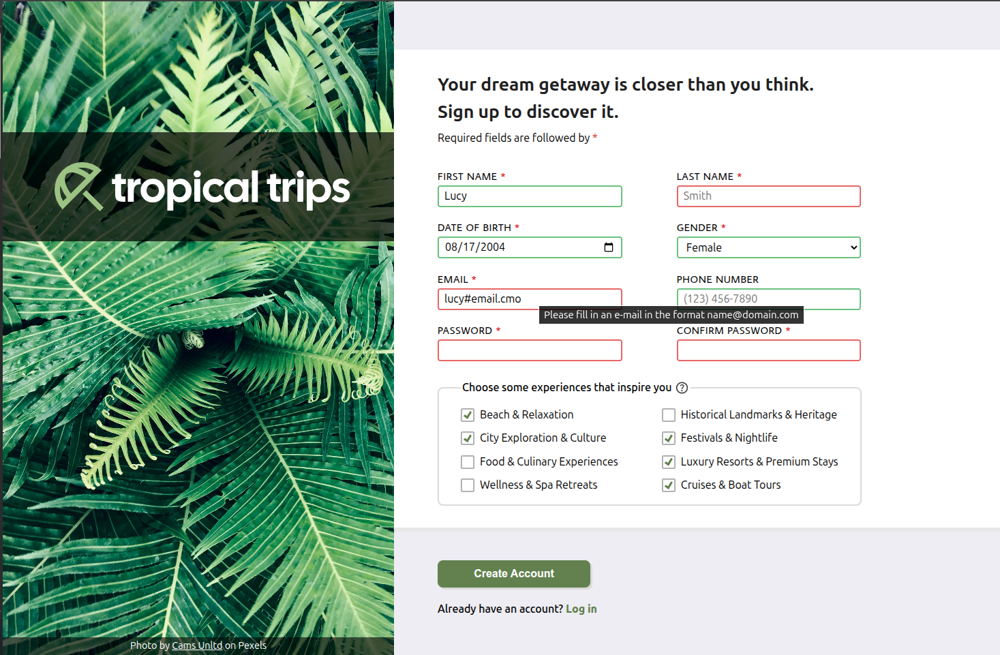

# Sign-up Form

## Description

- This is a sign-up form for a fictional travel booking platform called "Tropical Trips" built with HTML and CSS.
- The design folows this [reference template image](./assets/ref/sign-up-form-reference.png).
- **Features:**
    - A flexbox-based layout
    - Feedback for focus while filling a field
    - Feedback for success or failure after a field is filled
    - Form validation
    - Custom styled checkboxes

## Live Demo

**[Click here](https://pedroasb.github.io/sign-up-form/)** to try out this project on browser.

## Screenshots

## About the Project

This project is part of the curriculum of [The Odin Project](https://www.theodinproject.com/). You can check out other projects that I've built in my [fullstack-journey](https://github.com/PedroASB/fullstack-journey) repository.

## Attributions

- Icons by [Google](https://fonts.google.com/icons) – Licensed under Apache 2.0
- Font copyright © 2021 The Cal Sans Project Authors. Licensed under the [SIL Open Font License, Version 1.1](https://openfontlicense.org). Source: [https://github.com/calcom/font](https://github.com/calcom/font)
- Font copyright © 2012 Eduardo Tunni, with Reserved Font Name 'Average'. Licensed under the [SIL Open Font License, Version 1.1](https://openfontlicense.org). Source: [http://www.tipo.net.ar](http://www.tipo.net.ar)